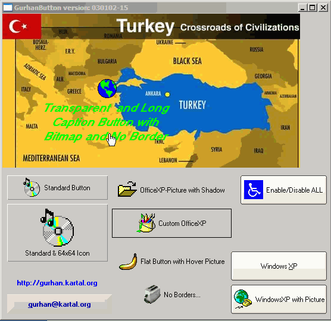

<div align="center">

## GurhanButton \- Major Updates


</div>

### Description

Major Updates...Now, Picture shadow on OfficeXP buttons, easier button setup...etc.
 
### More Info
 


<span>             |<span>
---                |---
**Submitted On**   |
**By**             |[Gurhan KARTAL](https://github.com/Planet-Source-Code/PSCIndex/blob/master/ByAuthor/gurhan-kartal.md)
**Level**          |Advanced
**User Rating**    |5.0 (45 globes from 9 users)
**Compatibility**  |VB 6\.0
**Category**       |[Custom Controls/ Forms/  Menus](https://github.com/Planet-Source-Code/PSCIndex/blob/master/ByCategory/custom-controls-forms-menus__1-4.md)
**World**          |[Visual Basic](https://github.com/Planet-Source-Code/PSCIndex/blob/master/ByWorld/visual-basic.md)
**Archive File**   |[](https://github.com/Planet-Source-Code/gurhan-kartal-gurhanbutton-major-updates__1-30380/archive/master.zip)


### Source Code

```
You can ALWAYS get the recent version at:
http://pscode.com/vb/scripts/showcode.asp?txtCodeId=30031&lngWId=1
or http://gurhan.kartal.org/visual_basic_projects.htm
```

